# PROTOCOL NFS

## 1. Què és i que ofereix?

El protocol NFS (Network File System) permet accedir a fitxers emmagatzemats en un servidor remot com si forenlocals. Està dissenyat per a sistemes Unix/Linux però és compatible amb altres plataformes.
### Funcionalitats principals:

    * ccés remot a fitxers: Permet compartir directoris entre dispositius.
    * Arquitectura client-servidor: Els clients munten recursos compartits pel servidor.
    * Transparència: Els fitxers remots semblen locals.
    * Compatibilitat multiplataforma: Funciona en entorns Unix, Linux i Windows.
    * Seguretat millorada (NFSv4): Inclou autenticació Kerberos i millor control d’accés.
    * Eficiència: Ideal per a xarxes LAN.

### Versions destacades:

    NFSv3: Suport per a fitxers grans i millor rendiment.
    NFSv4: Més segur i compatible amb TCP.

    Per vore la versió en el servidor:
    ```bash
    rpcinfo -p|grep nfs
    ```
    En el client
    ```bash
    
    ```

### Usos comuns:

    * Compartir dades en entorns col·laboratius.
    * Sistemes de còpies de seguretat.
    * Hosting d’imatges de màquines virtuals.

És ideal per a xarxes locals, però té limitacions de seguretat en versions antigues i no és òptim per a xarxes amb alta latència.

## 1. En VirtualBox
Instal·lar 2 Ubuntu configurant com a Xarxa Interna.
* Ubuntu servidor. IP: 192.168.0.100/24
* Ubuntu client. IP: 192.168.0.101/24

:mag:Els termes "servidor" i "client" no els hem de relacionar amb els d'un Domini ( xarxa amb un OpenLdap...).
Parlem de la funció de servidor d'arxius o impressió per a altres màquines connectades (clients).

## 2. En la part del "Servidor"

Després d'actualitzar el sistema ( *update/upgrade* )

### 2.1 Instal·lem el servei NFS en el Servidor

```bash
sudo apt install nfs-kernel-server
```
Comprovem que el servei està en marxa
```bash
systemctl status nfs-kernel-server 
```

### 2.2 Preparem les carpetes a exportar
Farem les proves següents:

|Carpeta|A qui|Permisos|
|---|---|---|
|/prova1| Tothom| Lectura i escriptura|
|/prova2|192.168.0.101|Lectura sols|

Després de crear les carpetes amb
```bash
sudo mkdir /prova1
```
Assignem permisos a tothom per a *rwx*. No tenim control d'usuaris en NFS. Només podrem restringir per IP (màquines)
```bash
sudo chmod 777 /prova1
```

### 2.3 Exportem editant el */etc/exports*

```bash
sudo nano /etc/exports
```

📝 Línies a afegir:

```makefile

/prova1 *(rw,sync) 
/prova2 192.168.0.101(ro,sync)
```
Quan la carpeta compartida està en un subdirectori, caldria indicar si farà una comprovació extra amb un tercer paràmtre:
subtree_check
no_subtree_check ( valor per defecte si no indiquem res )


/home/tomas/Documents/MarkDown 192.168.0.101(rw,sync,**no_subtree-check**)


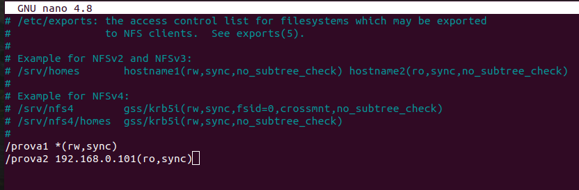

**Apliquem el canvi que hem fet al servidor**
```bash
sudo exportfs -a
```
L'opció "-s" ens dona informació dels directoris a exportar.


Comprovem el resultat.

L'opció "-s" ens dona més detall.

:mag: És convenient reiniciar el servei:
```bash
sudo systemctl restart nfs-kernel-server
```

⌨️  Tasca: Consulteu l'ajuda del *exportfs* amb *man exportfs*


## 3 En un client Linux.
 
### 3.1 Instal·lem al client el software requerit
Comprovem amb un ping que tenim connexió... (Connexió a nivell de HW, Enllac de dades i IP correcta ) 

```bash
sudo apt install nfs-common 
```

**Reiniciem els serveis funcionen**

Comprovem que el servici instal·lat està actiu...
```bash
systemctl restart nfs-common
```

**Revisem que els serveis funcionen**

Comprovem que el servici instal·lat està actiu...
```bash
systemctl status nfs-common
```
>NOTA:
>
>Si apareix el servei com masked, aneu a l'últim apartat on s'explica com solucionar-ho

**Consultem quin són els recursos que ens ha compartit** la màquina amb IP 192.168.0.100 ("servidor")

:computer: Resultat:

```bash
tomas@MVUbuntuClient:~$ sudo showmount -e 192.168.0.100
Export list for 192.168.0.100:
/prova1 *
/prova2 192.168.0.101
```
Entenem que:
* la carpeta */prova1* del "servidor" està compartida per a tothom ("clients")
* la carpeta */prova2* del "servidor" està compartida només per a la màquina 192.168.0.101 ("client")

### 3.2 Muntem a carpeta en local...

Crearem /PROVA1 i /PROVA2 en la màquina client local. Punts de muntatge.

:computer: Resultat

```bash
tomas@MVUbuntuClient:/$ sudo mkdir /PROVA1
tomas@MVUbuntuClient:/$ sudo mount -t nfs 192.168.0.100:/prova1 /PROVA1
tomas@MVUbuntuClient:/$ touch /PROVA1/f1.txt
```
Ara, en accedir a */PROVA1* i */PROVA2* del client estarem accedint a */prova1* i */prova2* del "servidor" amb els permisos que donats al servidor en crear-se ( chmod 777 ...)

⌨️ Comprova que tens permisos de *rwx* en PROVA1 però només de *rw* en PROVA2...

1.  Observa els permisos de les PROVA1 i PROVA2 ...*ls -l*
2.  Crea i elimina fitxers (touch) i carpetes (mkdir) en el servidor
3.  *Idem* al client.
4.  Visualitza els fitxer creats, navega per les carpetes.
5.  Intenta amb *sudo chmod* des del client canviar el permisos de PROVA1 o PROVA2... 

### 3.3 Fer el muntatge permanent.
Si reiniciem el "client" podem comprovar que:

* No veiem els fitxers creats en el servidor dins de les carpetes.
* Si podem navegar, llagir, crear o eliminar... fins i tot en  PROVA2.

**¿Què ha passat?**

Comprovem que el "servidor" encara comparteix les carpetes amb els mateixos permisos...
```bash
showmount -e 192.168.0.100
```

Però a la nostra màquina client, ja no tenim les tenim muntades des de que hem reiniciat. 
Ho comprovem:

```bash
 sudo mount -t nfs
```

**Modificar el fitxer fstab**

Hem de modificar el fiter fstab per a que el muntatge siga permanent. 

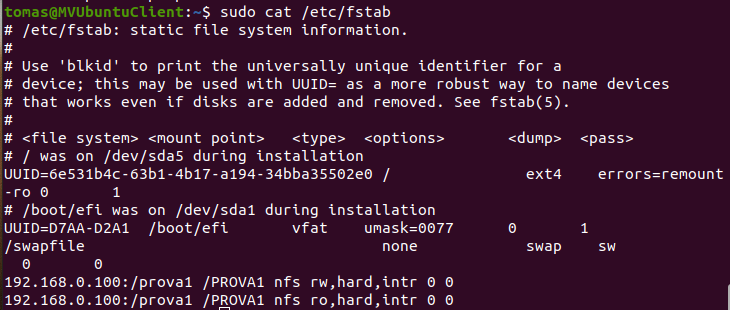


### 4 Podem denegar/permetre l'accés segons IP

* **/etc/hosts.allow**
* **/etc/hosts.deny**

1. Modificant estos fitxers permetem/deneguem (allow/deny) l'accés **per IPs**
2. xNO podem triar carpetes. Afecta a **tots els recursos** compartits.
3. Sí que podem limitar el **tipus de permís r,w,x** lectura (r),execució(r,x), escriptura (r,w)...

**Veiem un exemple:**

Compartim carpetes amb permisos donats...

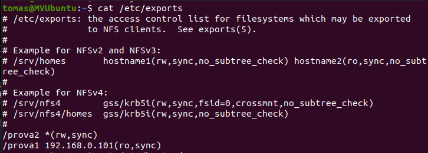

Deneguem a la IP 192.168.0.101 qualsevol accès per a escriptura (w)
Podríem afegir accés de lectura (r) o d'execució (x) seguit de comes: w,r  w,r,x...

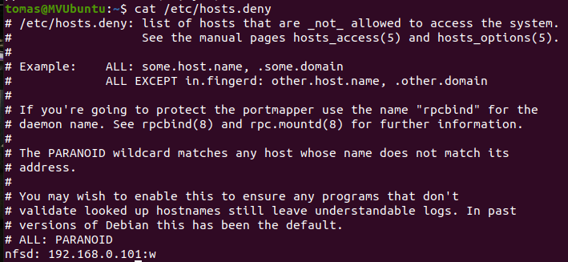

Comprovem l'efecte en el client amb la IP 

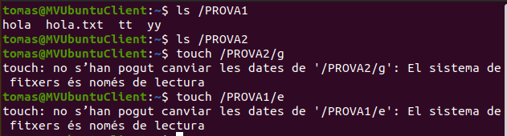

⌨️ Després de fer la prova, canvia la IP a la mateixa màquina "client" i prova-ho de nou...

## En un client Windows 1x

## Revisar el Firewall

En la configuració per defecte ve habilitada la regla que hi afecta però he de revisar-la.

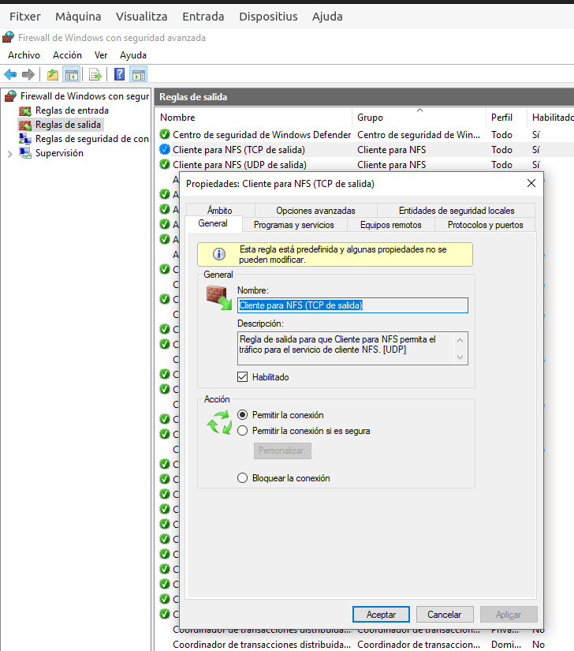

## Activar el servei.
Win + R
Regedit
Equipo\HKEY_LOCAL_MACHINE\SOFTWARE\Microsoft\ClientForNFS\CurrentVersion\Default

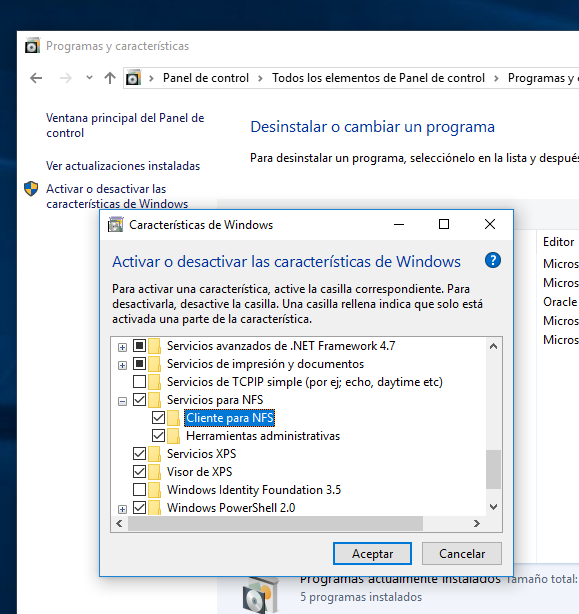

## Uid i Gid al Registre per a l'accès.
Busquem valors vàlids de *uid* i *gid*

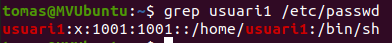

Al registre del sistema afegim 2 NOUS VALORS **DWORD** amb els noms **AnonymousUid** i **AnonymousGid** on posem un UID i un GID que coincidisca amb un que tinga permís en Linux.

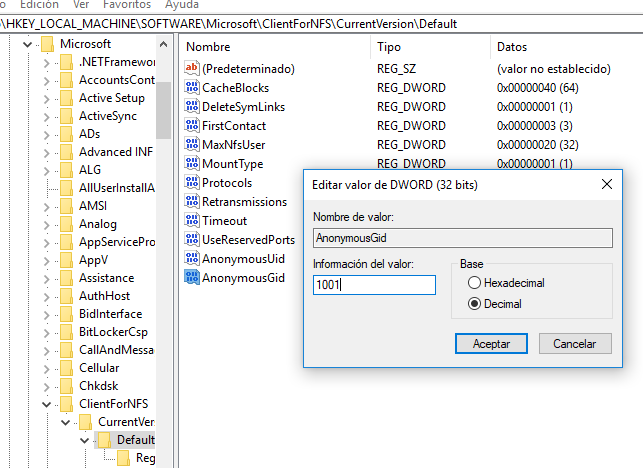


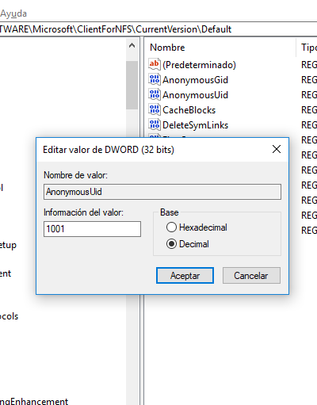

:mag: Compte! Marca la casella correcta per introduir el valor
[x]Decimal
[]Hexadecimal

Ja podem executar l'ordre del NFS Client per "muntar" la Unitat.
Veiem que només podem accedir de forma anònima.

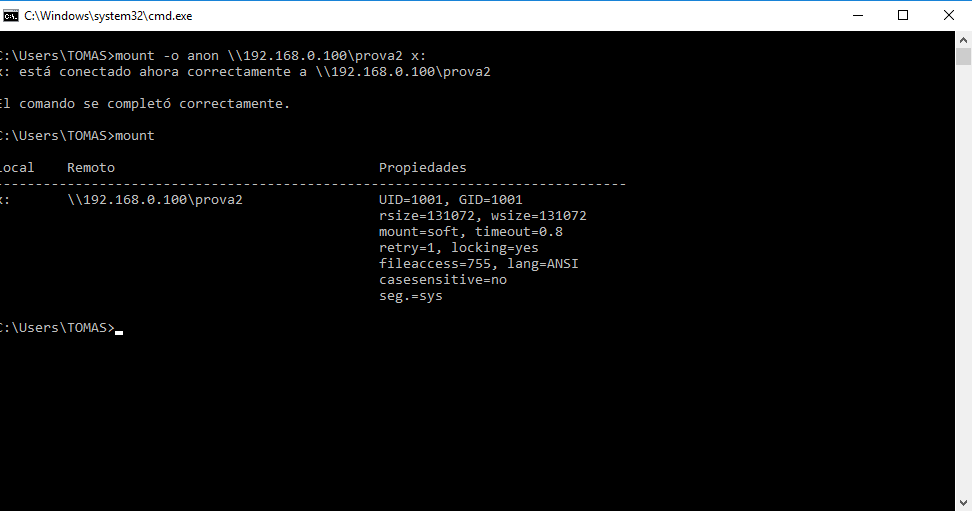

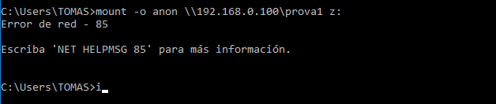

# 4 Problema "masked"

```bash
sudo systemctl is-enabled nfs-common
masked
```

```bash
sudo systemctl enable nfs-common
Synchronizing state of nfs-common.service with SysV service script with /lib/systemd/systemd-sysv-install.
Executing: /lib/systemd/systemd-sysv-install enable nfs-common
Failed to enable unit: Unit file /lib/systemd/system/nfs-common.service is masked.
```

El problema ve per l'enllaç simbòlic que apunta a /dev/null, hem de borrar-lo.

```bash
file /lib/systemd/system/nfs-common.service
/lib/systemd/system/nfs-common.service: symbolic link to /dev/null
```
```bash
sudo rm /lib/systemd/system/nfs-common.service
```
Recarreguem la configuració.

```bash
sudo systemctl daemon-reload
```
