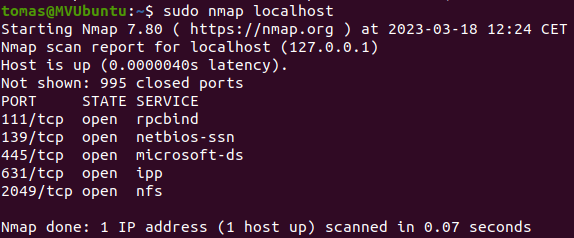

# PROTOCOL SAMBA
## 1  CONCEPTES PREVIS
### 1.1 Protocol SAMBA
És un protocol de xarxa que permet compartir recursos entre sistemes operatius diferents ( Windows i Linux, per exemple).

Disposem d'una implementació lliure i gratuïta. 
També ofereix característiques avançades com ara l'autenticació d'usuaris i gestió de permisos d'accés a fitxers o carpetes compartides.

### 1.2 NetBIOS
Molt relacionat tenim el protocol NetBIOS (Network Basic Input/Output System). És un protocol de xarxa utilitzat per Windows per compartir recursos i serveis entre SO Windows i altres.
Recalquem que SAMBA admet altres protocols de xarxa, com ara TCP/IP i SMB (Server Message Block), cosa que li permet interoperar amb diferents SO i dispositius oferint així més funcionalitat i compatibilitat

> **Note**
> 
> * SAMBA és molt útil en xarxes amb Linux i Windows.
> * Permet autenticació
> * Utilitza el protocol NetBIOS, però admet altres protocols.


## 2  INSTAL·LACIÓ al SERVIDOR
### 2.1 Software del Servidor
```bash
apt install samba
```
#### Comprovem l'estat del servei..
```bash       
sudo smbstatus
```
:computer: Resultat:
```makefile
tomas@MVUbuntu:~$ Samba version 4.15.13-Ubuntu
PID     Username     Group        Machine                                   Protocol Version  Encryption           Signing              
----------------------------------------------------------------------------------------------------------------------------------------

Service      pid     Machine       Connected at                     Encryption   Signing     
---------------------------------------------------------------------------------------------

No locked files
```
Alternativament...

```bash
sudo systemctl status smbd
```
>**Note**
>
>Pots buscar l'ajuda sobre [serveis en Ubuntu][serveisUbuntu]

### Comprovem el nou grup que s'ha creat
```bash
groups
```
```code
tomas adm cdrom sudo dip plugdev lpadmin lxd sambashare
```
```bash
cat /etc/group|grep samb*
```
💻 Resultat:
```code
sambashare:x:132:tomas
```

### Comprovem que la màquina escolta el ports adients
```bash
sudo nmap localhost
```



Ports per defecte de Samba
139 i 445

Més avant vorem com canviar el port per defecte

## 2.2 Compartim carpeta
### Des del Terminal
>**Warning**
>
>Recorda fer una còpia de seguretat abans de modificar qualsevol fitxer de configuració:
>```bash
>sudo cp /etc/samba/smb.conf /etc/samba/smb.conf.cop
>```
Editem el fitxer de configuració del servei.
```bash
sudo nano /etc/samba/smb.conf
```
:memo: Afegim una **secció** per cada recurs compartit com la següent:
```makefile
[directori1]
   comment = Directori compartit amb permís d'escriptura
   path = /directori1
   browseable = yes
   read only = no
   guest ok = yes
   create mask = 0755
```
Reiniciem el servei
```bash
sudo systemctl restart smbd
```

Secció de */etc/samba/smb.conf*
* *create mask* defineix quins permisos tindran els nous fitxer i carpetes creats dins de la carpeta compartida
* *guest ok* permet l'accès a un usauri no existent en Linux (servidor)
* *read only* sols lectura 
* *browseable* Carpeta navegable
   
:mag: Els permisos del servidor Linux sobrescriuen els que indiquem al *smb.conf*. 

Els revisem.
```bash
ls -l /directori1
```
```bash
sudo chmod 777 /directori1
```


## 3 CLIENT
### 3.1 Client Windows

Si en estos moments tenim un Windwos 10/11 instal·lat en un PC tal que:
1. El configurem en Xarxa Privada
2. El cablegem a la xarxa ( = MV VirtualBox configurada en la mateixa Xarxa Interna)
3. Un IP del mateix rang 192.168.0.102/24

Obtindrem el següent:


Per entrar hem de connectar a unitat de xarxa.

### Gràficament

Fer botó contrari i connectar a unitat de xarxa


Si no proporcionem unes credencials amb permís (usuari "tomas" del Ubuntu, al nostre cas), entrarem com a "guest" si està permés ( *guest ok = yes* )

## Amb el NET USE
Obrim el cmd de Windows


```bat
net use x: \\192.168.0.100\directori1 /user:tomas /persistent:yes
```

:mag: Si havíem entrat anteriorment des del client amb un altre usuari, haurem d'**eliminar la connexió anterior d'altre usuari** així:
```bat
net use x: /delete
```


:computer: Busca l'ajuda del comandament NET USE així:
```bat
net use /help
```

### 3.2 Client Ubuntu
#### Instal·lem el software
```bash
apt install smbclient
```

### 3.3 Connexió sense montar unitat

**Connexió anònima**

```bash
smbclient //192.168.0.100/directori1 -N
```
Per eixir: *exit* o *Control D*
```bash
smb: \> exit
```
**Connexió amb usuari del Servidor**
Si el servidor NO admet la connexió anònima ("guest ok = no" en /etc/samba/smb.conf)
```bash
smbclient //192.168.0.100/directori1 -U tomas
```
Ens demana la contrassenya.

O directament...

```bash
smbclient //192.168.0.100/directori1 -U tomas%contrassenya
```

:mag:Independentment de la connexió autenticada o anònima, el missatge:
"Try "help" to get a list of possible commands." Ens recorda que no estem en una sessió del Servidor Linux, sinó al client Samba

💻 Tasca:
* Observa amb *help* els comandaments disponibles.
* Prova algun disponible i algun dels no disponibles 

#### Comandaments "get" i "put" de smbclient

Una vegada en la sessió de client de Samba podem copiar cap al servidor (*put*) o des dels servidor (*get*)
##### ***get*** Servidor->Client


##### ***put*** Client->Servidor

 
### 3.4 Muntar unitat.
De forma similar al NFS podrem tindre les carpetes compartides del Servidor muntades al client, però amb Samba tindreḿ autoenticació d'usuari.
Igual que les teníem com a Unitats en Windows 10/11.

#### Instal·lem el software necessari
```bash
sudo apt install cifs-utils
```
#### Creem la carpeta a compartir del servidor i assignem permisos
:computer: Com exemple:
```makefile
tomas@MVUbuntu:~$ sudo mkdir /compartida
tomas@MVUbuntu:~$ sudo chmod -R 777 /compartida
tomas@MVUbuntu:~$ sudo chown nobody:nogroup /compartida
tomas@MVUbuntu:~$ ls -ld /compartida
drwxrwxrwx 2 nobody nogroup 4096 de març  18 23:18 /compartida
```
#### Creem la carpeta de punt de muntatge del client

:computer: Com exemple:

```makefile
rosa@MVUbuntuClient:~$ sudo mkdir /directori1
rosa@MVUbuntuClient:~$ sudo chown -R rosa:rosa /directori1
rosa@MVUbuntuClient:~$ sudo chmod 777 -R /directori1
rosa@MVUbuntuClient:~$ ls -ld /directori1/
drwxrwxrwx 2 rosa rosa 4096 de març  18 23:28 /directori1/
```
#### Muntem la carpeta
Fixem-nos amb el problema que apareix quan muntem la carpeta per a un usuari (rosa) o per a convidats (guest). 


Com veiem, en el muntatge **canvia de propietari la carpeta compartida...**

Se soluciona indicant qui serà el nou propietari amb el paràmetre **uid**

:computer: Com exemple
```makefile
rosa@MVUbuntuClient:~$ sudo mount -t cifs //192.168.0.100/compartida /directori1 -o guest,uid=rosa
rosa@MVUbuntuClient:~$ ls -ld /directori1/
drwxr-xr-x 2 rosa root 0 de març  19 01:02 /directori1/
rosa@MVUbuntuClient:~$ touch /directori1/noerror.txt
rosa@MVUbuntuClient:~$ ls -l /directori1
-rwxr-xr-x 1 rosa root 0 de març  19 01:44 noerror.txt
```


Quan ens hem connectat com "guest" creem com a "nobody:nogroup"
Quan ens hem connectat com a "rosa" creem com a "rosa:rosa"

*Des del client...*


*Des del servidor...*


Veiem un darrer exemple on usem el **uid** i el **gid**


Del *ls -l* observem que:

* *rosa* té permís per crear
* El grup *tomas* té per a llegir, no per escriure. Per això l'usuari *tomas* ( pertanyent al grup *tomas*) por llegir però no crear

>**Note**
>Al document de [WorkGroup amb SAMBA][WGSamba] tens un exemple de Servidor Linux de Grup de Treball amb carpetes compartides per a Linux i Windows.
>Mira'l.


[serveisUbuntu]:https://github.com/tofermos/ISO/blob/main/serveis.md
[WGSamba]:https://github.com/tofermos/ISO/blob/main/WorkGroupSAMBA.md
