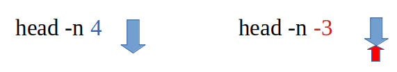

# ORDRE head

L'ordre *head* obté les 10 primeres línies d'un fitxer de text pla ( o eixida d'ordres )

## Exemple:
A partir d'un *ls* del directori ens treu el següent contingut.
```bash
tomas@portatil:~/Documents/textos$ ls
f01  f03  f05  f07  f09  f11  f13
f02  f04  f06  f08  f10  f12
```
Comencem a usar el *head*
```bash
tomas@portatil:~/Documents/textos$ ls|head
f01
f02
f03
f04
f05
f06
f07
f08
f09
f10
```
Podem canviar el valor per defecte de 10 per altre.
```bash
tomas@portatil:~/Documents/textos$ ls|head -n 2
f01
f02
```
La capçalera ( primeres línies ) fins la N-última. *head -n N*
```bash
tomas@portatil:~/Documents/textos$ ls|head -n -9
f01
f02
f03
f04
```
## Exemple 2:
Aplicarem el *head* al següent fitxer de text...
```bash
tomas@portatil:~/Documents/textos$ ls>fitxer.txt
tomas@portatil:~/Documents/textos$ cat fitxer.txt 
f01
f02
f03
f04
f05
f06
f07
f08
f09
f10
f11
f12
f13
fitxer.txt
```
10 primeres línies
```bash
tomas@portatil:~/Documents/textos$ head fitxer.txt 
f01
f02
f03
f04
f05
f06
f07
f08
f09
f10
```
3 primeres línies
```bash
tomas@portatil:~/Documents/textos$ head -n 3 fitxer.txt 
f01
f02
f03
```
La capçalera ( primeres línies ) fins la N-última. *head -n N*
```bash
tomas@portatil:~/Documents/textos$ head -n -3 fitxer.txt 
f01
f02
f03
f04
f05
f06
f07
f08
f09
f10
f11
```

