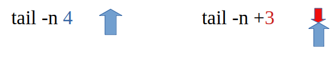

# ORDRE tail

L'ordre *tail* obté les 10 darreres línies d'un fitxer de text pla ( o eixida d'ordres )

## Exemple 1:
A partir d'un *ls* del directori ens treu el següent contingut.
```bash
tomas@portatil:~/Documents/textos$ ls
f01  f03  f05  f07  f09  f11  f13
f02  f04  f06  f08  f10  f12
```
Comencem a usar el *tail*. Les 10 darreres línies.
```bash
tomas@portatil:~/Documents/textos$ ls |tail
f05
f06
f07
f08
f09
f10
f11
f12
f13
fitxer.txt
```
Les 3 darreres línies de la cua
```bash
tomas@portatil:~/Documents/textos$ ls |tail -n 3
f12
f13
fitxer.txt
```
La cua sencera excepte les 3 primeres línies. *tail -n -N*
```bash
tomas@portatil:~/Documents/textos$ ls |tail -n +3
f03
f04
f05
f06
f07
f08
f09
f10
f11
f12
f13
fitxer.txt
```
## Exemple 2. 
A partir d'un fitxer de text.
```bash
tomas@portatil:~/Documents/textos$ ls>fitxer.txt
tomas@portatil:~/Documents/textos$ cat fitxer.txt 
f01
f02
f03
f04
f05
f06
f07
f08
f09
f10
f11
f12
f13
fitxer.txt
```
Les 10 darreres línies ( per defecte )
```bash
tomas@portatil:~/Documents/textos$ tail fitxer.txt 
f05
f06
f07
f08
f09
f10
f11
f12
f13
fitxer.txt
```
Canviem el valro per defecte. Les 5 darreres línies
```bash
tomas@portatil:~/Documents/textos$ tail -n 5 fitxer.txt 
f10
f11
f12
f13
fitxer.txt
```
La cua fins la 8ª línia
```bash
tomas@portatil:~/Documents/textos$ tail -n +8 fitxer.txt 
f08
f09
f10
f11
f12
f13
fitxer.txt
tomas@portatil:~/Documents/textos$
```


